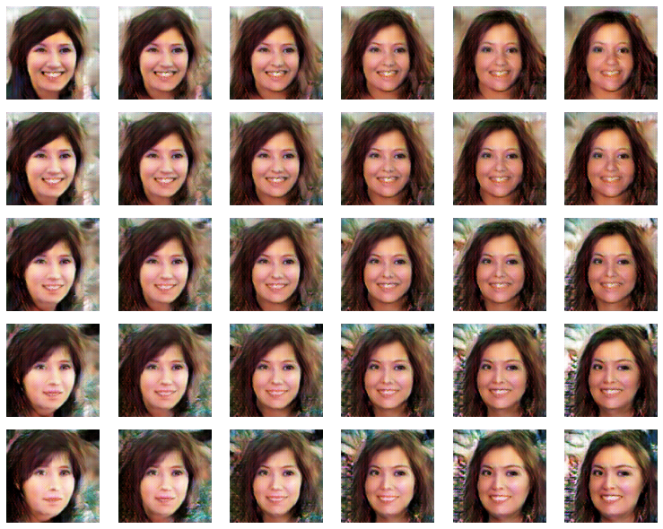

# Face GAN
Fake faces generation with generative adversarial networks

To be arranged...

[colab](https://colab.research.google.com/drive/1OutTQn5DaUqsI9kIt8ki495PD4IzHHpJ?usp=sharing) link

# Description
This project is continuation and extension of homework from [Deep Learning School](https://dls.samcs.ru/) course

As a model, [DCGAN](https://pytorch.org/tutorials/beginner/dcgan_faces_tutorial.html) is used, modified to deal with 128x128 images

I've implemented a lot of [GAN hacks](https://github.com/soumith/ganhacks) to add stability to the generator-discriminator competition:
- GaussianNoise module to disturb inner representations of discriminator
- GaussianNoiseUpdater to change discriminator inner representation noise std
  - simple decreasing of std to gradually strengthen the discriminator 
  - can be used as cycle
  - turn off noise after certain number of epochs to make generator produce less noisy images
- GanBuffer to give to discrimator some previous images to slow down its discriminating power and not allow to "supress" generator
- Label smoothing and random label flips for discriminator

Other cool features (see [work examples](#work-examples)):
- GIF of training process with fixed "faces"
- 1D and 2D face smoothing (done with convex combination of noise vectors)

# Data
The [Flickr-Faces](https://github.com/NVlabs/ffhq-dataset) dataset (resized to [128x128](https://www.kaggle.com/datasets/dullaz/flickrfaces-dataset-nvidia-128x128)) is used to train networks

# Work examples
All wandb experiment logs available [here](https://wandb.ai/kharinaev/face_gan)

Training process GIF

1D faces smoothing

2D faces smoothing

# To do
- reduce dataset diversity using clusterisation methods to increase generation accuracy 
  - pretrained CNNs with no head for extracting usefull features/embeddings
  - [DL face landmarks](https://github.com/1adrianb/face-alignment) (to get faces with similar poses)
- compare data storage methods to speed up dataloader (memmap, hdf5, etc.)
